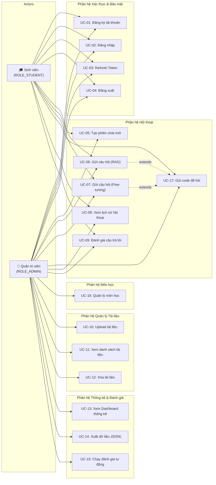
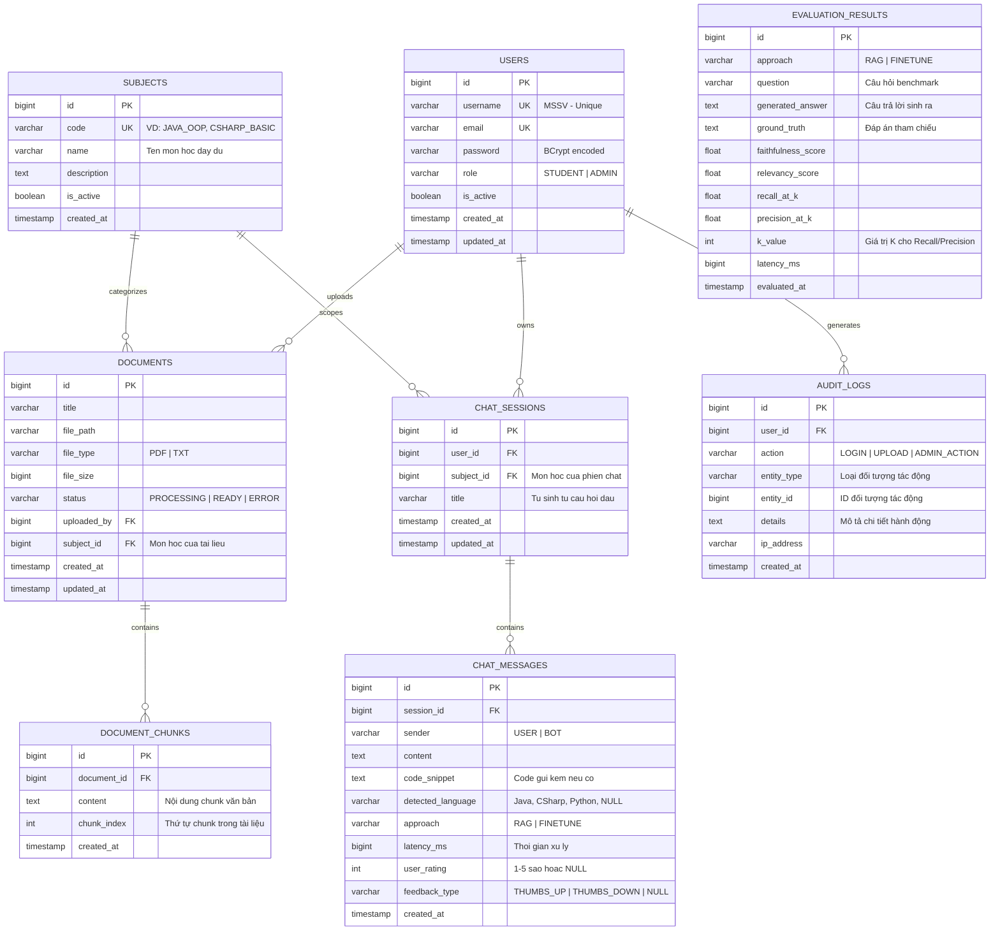
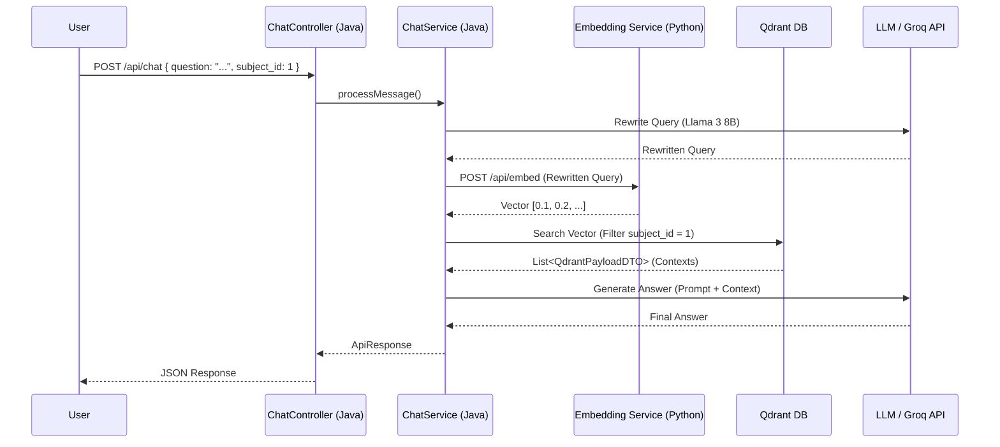

# 📝 TÀI LIỆU ĐẶC TẢ YÊU CẦU HỆ THỐNG DỰ ÁN MÔN HỌC JAVAPROJECT (SRS)

## CHƯƠNG 1: GIỚI THIỆU TỔNG QUAN

### 1.1. Mục tiêu Dự án

Dự án nhằm phát triển một hệ thống Chatbot thông minh hỗ trợ sinh viên tra cứu tài liệu môn học bằng tiếng Việt. Đồng thời, dự án đóng vai trò là một công trình thực nghiệm để đối chứng, đánh giá và so sánh hiệu năng toàn diện giữa hai phương pháp tiếp cận AI tiên tiến hiện nay: **RAG (Retrieval-Augmented Generation)** chạy trên nền tảng Java thuần và **Fine-tuning (Huấn luyện chuyên biệt)** thông qua một cầu nối microservice.

### 1.2. Phạm vi Hệ thống

Hệ thống được thiết kế dưới dạng ứng dụng Web Enterprise.

* **Phần lõi quản trị và điều phối:** Do Java Spring Boot đảm nhiệm.
* **Phần lưu trữ dữ liệu quan hệ và dữ liệu không gian vector:** Sử dụng hạ tầng điện toán đám mây Supabase Cloud.
* **Phần xử lý mô hình trí tuệ nhân tạo:** Sử dụng kết hợp thư viện LangChain4j (Java) và FastAPI (Python).

---

## CHƯƠNG 2: MÔ HÌNH HÓA CHỨC NĂNG (FUNCTIONAL REQUIREMENTS)

Hệ thống được phân rã thành 4 phân hệ chức năng chính với các yêu cầu chi tiết sau:

### 2.1. Phân hệ Quản lý Người dùng & Bảo mật (Auth & Identity Subsystem)

* **RF-01: Đăng ký tài khoản:** Cho phép sinh viên tạo tài khoản mới bằng Mã số sinh viên (MSSV), mật khẩu và email trường.
* **RF-02: Đăng nhập & Cấp Token:** Xác thực thông tin người dùng. Nếu chính xác, hệ thống sinh mã **JWT (JSON Web Token)** chứa các trường: `userId`, `username`, `role`, và thời gian hết hạn (Expiration Time).
* **RF-03: Kiểm soát phân quyền (RBAC):** Chặn và phân luồng quyền truy cập tại tầng Filter:
* `ROLE_STUDENT`: Có quyền sử dụng Chatbot (RAG/Fine-tune), xem lịch sử cá nhân, chấm điểm câu trả lời.
* `ROLE_ADMIN`: Có toàn quyền của Student, cộng thêm quyền upload tài liệu và truy cập Dashboard hệ thống.


### 2.2. Phân hệ Nạp & Xử lý Tài liệu (Data Ingestion Subsystem)

* **RF-04: Tải lên tài liệu:** Admin có thể upload các file tài liệu học thuật định dạng `.pdf` hoặc `.txt`. Khi upload, Admin **phải gắn môn học** (`subject_id`) cho tài liệu để hệ thống phân loại. Thông tin môn học này được sử dụng ngầm bởi hệ thống khi xếp hạng kết quả truy xuất, **không hiển thị ra giao diện người dùng**.
* **RF-05: Trích xuất nội dung (Text Parsing):** Hệ thống phải có khả năng đọc và chuyển đổi toàn bộ nội dung file văn bản sang chuỗi text, đồng thời tự động lọc bỏ các ký tự rác hoặc định dạng không hợp lệ.
* **RF-06: Cắt nhỏ văn bản (Semantic Chunking):** Hệ thống phải tự động phân chia văn bản gốc thành các đoạn nhỏ (chunks) theo ngữ nghĩa tiếng Việt. Quá trình cắt phải đảm bảo không làm đứt gãy các từ ghép hoặc câu hoàn chỉnh.
* **RF-07: Tạo và Lưu Vector (Embedding Vectorization):** Hệ thống phải chuyển đổi các đoạn văn bản (chunks) thành biểu diễn vector số thực. Các vector này sau đó phải được lưu trữ đồng bộ trên cơ sở dữ liệu để phục vụ cho tính năng tìm kiếm tương đồng (Similarity Search) sau này. Metadata về nguồn gốc (thuộc môn học nào) phải được gắn kèm mỗi vector.

### 2.3. Phân hệ Điều phối Hội thoại Lai (Hybrid Chat Orchestrator)

* **RF-08: Quản lý Phiên chat (Session Management):** Sinh viên có thể tạo nhiều phiên chat riêng biệt. Khi tạo phiên mới, sinh viên **chọn môn học** (`subject_id`) từ danh sách do Admin cấu hình, để hệ thống giới hạn phạm vi truy xuất tài liệu đúng ngữ cảnh. Mỗi phiên có một `sessionId`, `subject_id` và tiêu đề được **tự động sinh dựa trên câu hỏi đầu tiên**. Tên môn học được hiển thị trên giao diện chat để người dùng luôn biết ngữ cảnh hiện tại.
* **RF-09: Thực thi Luồng RAG (Java Native Pipeline):** Khi ở chế độ RAG:
  1. **Tiền xử lý đầu vào:** Phân tích nội dung tin nhắn, phát hiện xem có chứa đoạn mã nguồn hay không (xem RF-18). Nếu có code, tách riêng phần code và phần câu hỏi tự nhiên.
  2. **Embedding:** Chuyển câu hỏi của sinh viên thành vector.
  3. **Truy xuất theo môn học qua Qdrant (Subject-Scoped ANN Search):** Gửi vector câu hỏi đến **Qdrant**, lọc theo `subject_id` của phiên chat hiện tại (sử dụng Qdrant filter payload), để lấy ra Top $K$ đoạn văn bản liên quan nhất với tốc độ ANN. Sau khi nhận được danh sách `chunk_id` từ Qdrant, hệ thống truy ngược về Supabase để lấy nội dung text gốc của các chunks. Điều này đảm bảo khi sinh viên hỏi "khai báo interface" trong phiên môn Java, hệ thống chỉ truy xuất tài liệu Java, không lẫn sang C# hay ngôn ngữ khác.
  4. **Xây dựng Prompt:** Tích hợp cấu trúc Prompt tiếng Việt bao gồm: Context + Câu hỏi + Code snippet (nếu có).
  5. **Sinh phản hồi:** Gửi Prompt đến LLM qua thư viện LangChain4j và trả kết quả theo dạng Streaming/Text về giao diện.


* **RF-10: Thực thi Luồng Fine-tuning (Python Bridge Pipeline):** Khi ở chế độ Fine-tuning, Backend Java sẽ đảm nhận việc điều phối chính:
  1. **Tiếp nhận & Xác thực (Java):** Spring Boot nhận request từ Frontend, xác thực JWT và kiểm tra quyền.
  2. **Tiền xử lý đầu vào (Java):** Phát hiện và tách code snippet ra khỏi câu hỏi (nếu có), gắn metadata `subject_id` từ session vào payload.
  3. **Chuẩn bị Ngữ cảnh (Java):** Trích xuất lịch sử chat (Chat Memory) từ Database để ghép nối vào câu hỏi.
  4. **Chuyển tiếp (Java -> Python):** Spring Boot sử dụng `WebClient` làm Proxy để đẩy payload (câu hỏi + lịch sử + code + subject context) qua giao thức HTTP sang Microservice Python FastAPI.
  5. **Sinh văn bản (Python):** Python FastAPI chuyển tiếp dữ liệu vào mô hình ngôn ngữ lớn local đã được cấu hình trọng số Fine-tune (LoRA) để sinh câu trả lời.
  6. **Lưu trữ & Trả về (Java):** Spring Boot nhận kết quả từ Python, tiến hành lưu cặp câu hỏi/trả lời mới vào Database (Supabase) và bọc kết quả trong `ApiResponse` trả về Frontend.


* **RF-11: Xử lý Ngữ cảnh (Chat Memory & Query Rewriting):** 
  * Hệ thống lưu trữ 5 cặp câu hỏi-trả lời gần nhất trong cùng một phiên.
  * **Kỹ thuật Query Rewriting:** Trước khi thực hiện tìm kiếm Vector (RAG), hệ thống bắt buộc sử dụng một LLM phụ trợ siêu tốc độ (thông qua **Groq API - Llama 3.1 8B**) để phân tích câu hỏi mới nhất dựa trên lịch sử chat, và "viết lại" (rewrite) thành một câu hỏi đầy đủ ngữ nghĩa độc lập. (Ví dụ: "Nó khác abstract class ở đâu?" -> "Interface khác abstract class ở đâu?"). Câu hỏi sau khi được viết lại mới được mang đi sinh Vector, đảm bảo độ chuẩn xác 100% khi truy xuất Qdrant.
* **RF-12: Thu thập phản hồi và Blind Test (Feedback Collection & A/B Testing):** 
  * Cơ bản: Sinh viên có quyền nhấn nút Thumbs Up/Down hoặc chấm điểm từ 1 đến 5 sao cho từng câu trả lời để hệ thống ghi nhận tính chính xác.
  * **Blind Test:** Vì mục tiêu cốt lõi là so sánh, hệ thống sẽ có cơ chế "Test Mù". Thỉnh thoảng (tần suất có thể cấu hình), khi sinh viên đặt câu hỏi, hệ thống sẽ chạy song song cả luồng RAG và Fine-tuning, sau đó trả về 2 câu trả lời cạnh nhau ẩn danh ("Câu trả lời A" và "Câu trả lời B"). Sinh viên được yêu cầu bình chọn câu trả lời tốt hơn trước khi chat tiếp. Dữ liệu này được ưu tiên dùng cho biểu đồ so sánh.

### 2.4. Phân hệ Thống kê & Xuất Dữ liệu (Analytics & Data Exporter)

* **RF-13: Đo đếm hiệu năng (Metric Logging):** Với mỗi tin nhắn được gửi đi, hệ thống ngầm ghi vết:
* `latency_ms`: Thời gian xử lý từ lúc nhận request đến lúc sinh xong phản hồi (bằng `System.currentTimeMillis()`).
* `approach_used`: Ghi rõ câu này được xử lý bằng RAG hay Fine-tune.


* **RF-14: Kết xuất dữ liệu huấn luyện (Training Data Exporter):** Admin có thể kích hoạt tính năng quét bảng `chat_messages`, lọc ra các cặp câu hỏi-trả lời được sinh viên chấm 5 sao, tự động format thành cấu trúc JSON dạng: `{"messages": [{"role": "user", "content": "..."}, {"role": "assistant", "content": "..."}]}` và xuất ra file `.jsonl`.
* **RF-15: Dashboard đối sánh (A/B Testing Analytics):** Hệ thống xử lý các phép toán thống kê và trả về dữ liệu dạng đồ thị biểu diễn:
* Biểu đồ đường so sánh thời gian phản hồi trung bình (Average Latency) của RAG vs Fine-tuning.
* Biểu đồ cột so sánh điểm số hài lòng trung bình (User Satisfaction Rate).

* **RF-16: Tiêu chí Đánh giá & So sánh (Evaluation Metrics):** Vì mục tiêu cốt lõi của hệ thống là so sánh RAG và Fine-tuning, hệ thống phải cung cấp công cụ tự động chạy các độ đo (metrics) sau trên tập dữ liệu chuẩn (Benchmark Dataset):
  * **Faithfulness (Độ trung thực):** Đánh giá xem câu trả lời của AI có bám sát vào ngữ cảnh/tài liệu được cung cấp hay không (tránh ảo giác - hallucination).
  * **Answer Relevancy (Độ phù hợp):** Đánh giá mức độ câu trả lời giải quyết trực tiếp câu hỏi gốc của người dùng.
  * **Average Latency (Thời gian phản hồi TB):** So sánh tốc độ sinh văn bản giữa luồng truy xuất qua Vector DB (RAG) so với gọi trực tiếp mô hình đã huấn luyện (Fine-tuning).
  * **Retrieval Metrics (Recall@K & Precision@K):** Đo lường chất lượng tìm kiếm của Qdrant trong luồng RAG.
  Kết quả được lưu vào bảng `evaluation_results` để đối chiếu định lượng.

### 2.5. Phân hệ Quản lý Môn học & Xử lý Đầu vào Nâng cao

* **RF-17: Quản lý Danh mục Môn học (Subject Management):** Admin có thể tạo, sửa, xóa danh mục môn học. Mỗi môn học (`subjects`) có `code` (ví dụ: `JAVA_OOP`, `CSHARP_BASIC`, `DSA`), `name` (tên đầy đủ) và `description`. Danh mục này được sử dụng để:
  * Phân loại tài liệu khi Admin upload (RF-04).
  * Hiển thị danh sách môn học cho sinh viên chọn khi tạo phiên chat (RF-08).
  * Giới hạn phạm vi truy xuất tài liệu theo đúng ngữ cảnh môn học (RF-09).

* **RF-18: Xử lý Tin nhắn có Mã nguồn (Code-Aware Message Processing):** Hệ thống hỗ trợ sinh viên gửi tin nhắn có chứa đoạn mã nguồn (code snippet) để hỏi đáp. Cụ thể:
  1. **Phát hiện Code:** Hệ thống tự động nhận diện đoạn mã nguồn trong tin nhắn thông qua:
     * Cú pháp Markdown code block (` ``` `).
     * Phát hiện heuristic dựa trên từ khóa lập trình (`public`, `class`, `void`, `import`, `#include`, `def`, v.v.).
  2. **Tách & Gắn nhãn:** Khi phát hiện code, hệ thống tách riêng phần code và phần câu hỏi tự nhiên. Ngôn ngữ lập trình được xác định dựa vào môn học (`subject`) của phiên chat hiện tại.
  3. **Nhúng vào Prompt:** Code snippet được đưa vào Prompt Template trong một khối riêng biệt (ví dụ: `[CODE_CONTEXT]`), kèm theo chỉ thị cho LLM phân tích code trong ngữ cảnh môn học đã chọn.
  4. **Hiển thị kết quả:** Câu trả lời từ LLM có chứa code sẽ được render với **syntax highlighting** trên giao diện Frontend, hỗ trợ copy nhanh.

### 2.6. Biểu đồ Use Case (Use Case Diagram)

Biểu đồ mô tả tương tác giữa 2 tác nhân chính (**Sinh viên** và **Quản trị viên**) với hệ thống.

**Tóm tắt các luồng Use Case chính (Mức khái quát):**
```text
Sinh viên (Student)
 ├─ Chat RAG (Truy xuất tài liệu)
 ├─ Chat Fine-tune (Hỏi mô hình đã huấn luyện)
 ├─ Gửi code để hỏi
 └─ Xem lịch sử & Đánh giá câu trả lời

Quản trị viên (Admin)
 ├─ (Có mọi quyền của Sinh viên)
 ├─ Quản lý Môn học
 ├─ Upload & Quản lý Tài liệu (PDF/TXT)
 └─ Xem Dashboard & Đánh giá tự động
```

**Sơ đồ Use Case tổng thể:**



#### Mô tả Use Case chi tiết

| Mã UC | Tên Use Case | Tác nhân | Mô tả ngắn | Yêu cầu liên quan |
|-------|-------------|----------|-------------|--------------------|
| UC-01 | Đăng ký tài khoản | Sinh viên, Admin | Tạo tài khoản mới bằng MSSV, mật khẩu, email | RF-01 |
| UC-02 | Đăng nhập | Sinh viên, Admin | Xác thực và nhận JWT Token | RF-02 |
| UC-03 | Refresh Token | Sinh viên, Admin | Gia hạn Access Token khi hết hạn | RF-02 |
| UC-04 | Đăng xuất | Sinh viên, Admin | Vô hiệu hóa token hiện tại | RF-02 |
| UC-05 | Tạo phiên chat mới | Sinh viên, Admin | Chọn môn học và tạo session chat mới | RF-08, RF-17 |
| UC-06 | Gửi câu hỏi (RAG) | Sinh viên, Admin | Hỏi đáp qua luồng RAG, lọc theo môn học | RF-09, RF-11 |
| UC-07 | Gửi câu hỏi (Fine-tuning) | Sinh viên, Admin | Hỏi đáp qua luồng Fine-tuning (Python Bridge) | RF-10, RF-11 |
| UC-08 | Xem lịch sử hội thoại | Sinh viên, Admin | Xem lại các cuộc hội thoại trước đó | RF-08 |
| UC-09 | Đánh giá & Blind Test | Sinh viên, Admin | Chấm điểm (Rating) hoặc chọn Mô hình A/B | RF-12 |
| UC-10 | Upload tài liệu | Admin | Tải lên tài liệu PDF/TXT, gắn vào môn học | RF-04, RF-05, RF-06, RF-07 |
| UC-11 | Xem danh sách tài liệu | Admin | Xem và quản lý tài liệu đã upload | RF-04 |
| UC-12 | Xóa tài liệu | Admin | Xóa tài liệu và vector liên quan | RF-04 |
| UC-13 | Xem Dashboard thống kê | Admin | Xem biểu đồ so sánh RAG vs Fine-tuning | RF-15 |
| UC-14 | Xuất dữ liệu JSONL | Admin | Xuất dữ liệu huấn luyện từ chat có rating cao | RF-14 |
| UC-15 | Chạy đánh giá tự động | Admin | Thực thi benchmark Faithfulness, Relevancy | RF-16 |
| UC-16 | Quản lý môn học | Admin | CRUD danh mục môn học (JAVA_OOP, DSA...) | RF-17 |
| UC-17 | Gửi code để hỏi | Sinh viên, Admin | Gửi code snippet kèm câu hỏi, hệ thống tự detect | RF-18 |

### 2.7. Ma trận Phân quyền (RBAC Authorization Matrix)

Bảng dưới đây quy định quyền hạn truy cập của từng Role đối với các tính năng trong hệ thống:

| Tính năng (Feature) | Sinh viên (`ROLE_STUDENT`) | Quản trị viên (`ROLE_ADMIN`) | Ghi chú |
| :--- | :---: | :---: | :--- |
| **Đăng nhập, Đăng ký, Refresh Token** | ✅ | ✅ | Bất kỳ ai cũng có thể tạo tài khoản Sinh viên. Tài khoản Admin do Database khởi tạo. |
| **Chat RAG / Fine-tuning** | ✅ | ✅ | Admin cũng có thể chat để kiểm thử hệ thống. |
| **Xem lịch sử hội thoại** | ✅ (Chỉ của bản thân) | ✅ (Chỉ của bản thân) | Không ai được xem phiên chat của người khác. |
| **Đánh giá câu trả lời (Rating)** | ✅ | ✅ | |
| **Quản lý danh mục Môn học** | ❌ | ✅ | Thêm, sửa, xóa môn học. |
| **Quản lý Tài liệu (Upload, Delete)** | ❌ | ✅ | Upload PDF/TXT, hệ thống tự động băm (chunk) và lưu vector. |
| **Xem thống kê (Dashboard)** | ❌ | ✅ | Biểu đồ Latency, User Satisfaction. |
| **Xuất dữ liệu huấn luyện (JSONL)** | ❌ | ✅ | Lọc các câu trả lời 5 sao để huấn luyện lại. |
| **Chạy Benchmark Đánh giá (Auto Eval)** | ❌ | ✅ | Tính toán Recall@K, Faithfulness... |

---

## CHƯƠNG 3: YÊU CẦU PHI CHỨC NĂNG (NON-FUNCTIONAL REQUIREMENTS)

### 3.1. Tính Bảo mật & Toàn vẹn Dữ liệu (Security & Integrity)

* **NFR-01:** Toàn bộ mật khẩu người dùng phải được mã hóa một chiều bằng thuật toán **BCrypt** trước khi ghi vào cơ sở dữ liệu Supabase. Không chấp nhận lưu mật khẩu dạng văn bản thô (Plain text).
* **NFR-02:** Token JWT phải được cấu hình thời gian sống ngắn (ví dụ: 24 giờ) và được ký bằng một chuỗi Secret Key bảo mật cao lưu trữ trong biến môi trường (`Environment Variable`).

### 3.2. Hiệu năng & Khả năng chịu tải (Performance & Scalability)

* **NFR-03:** Thời gian phản hồi (Response Time):
  * Đối với các truy vấn CRUD cơ bản (Lấy thông tin profile, lịch sử chat): Phải phản hồi trong vòng **< 100ms**.
  * Đối với các tác vụ sinh văn bản của AI (RAG hoặc Fine-tuning): Phải bắt đầu trả về luồng phản hồi (Streaming) trong vòng **1 đến 3 giây** tính từ lúc người dùng gửi câu hỏi.
* **NFR-04:** Hệ thống phải sử dụng cơ chế Connection Pool để quản lý kết nối, đảm bảo không bị ngắt đột ngột (Timeout) hoặc cạn kiệt số lượng connection khi chịu tải cao.

### 3.3. Tính Tương thích & Ngôn ngữ (Localization)

* **NFR-05:** Hệ thống hỗ trợ chuẩn mã hóa **UTF-8** ở mọi tầng xử lý.
* **NFR-06:** Giao diện, thông báo lỗi (`Exception Messages`), dữ liệu trả về từ Chatbot phải hiển thị chuẩn tiếng Việt, có dấu và đúng ngữ pháp.

---

## CHƯƠNG 4: SƠ ĐỒ KIẾN TRÚC & RÀNG BUỘC KỸ THUẬT

### 4.1. Kiến trúc Hệ thống Tổng thể (System Architecture Map)

Hệ thống hoạt động theo mô hình lai phân tán giữa hai nền tảng công nghệ Java và Python, kết nối thông qua Cloud Database:

```text
[ Giao diện Web Client (Thymeleaf/React) ]
                 │
                 │ (HTTP REST API + JWT Token)
                 ▼
 ┌────────────────────────────────────────────────────────┐
 │            BACKEND JAVA SPRING BOOT SERVER             │
 │                                                        │
 │ ┌──────────────────────┐    ┌────────────────────────┐ │
 │ │    Spring Security   │    │      LangChain4j       │ │
 │ │ (Bộ lọc JWT Filter)  │    │   (Điều phối RAG)      │ │
 │ └──────────┬───────────┘    └───────────┬────────────┘ │
 └────────────┼────────────────────────────┼──────────────┘
      │       │                    │       │
      │       │ (Đọc/Ghi SQL)      │       │ (Gọi REST API qua LLM/Embed)
      │       ▼                    ▼       │
      │  ┌────────────┐    ┌───────────────┴────────┐
      │  │ SUPABASE DB│    │ PYTHON FASTAPI BRIDGES │
      │  │ (pgvector) │    │ - Model Fine-tune (8000│
      │  └──────┬─────┘    │ - Embeddings ONNX (8001│
      │         │          └───────────────┬────────┘
      │ (Truy vấn ANN)                     │ (Sinh Vector)
      ▼         ▼                          ▼
 ┌──────────────────────────────────────────────────┐
 │               QDRANT VECTOR DB                   │
 │            (ANN Search + Nén SQ)                 │
 └──────────────────────────────────────────────────┘
```

### 4.2. Công nghệ Cứng của Dự án (Tech Stack Constraints)

* **Tầng Frontend (Web Client):** Thymeleaf (hoặc **ReactJS**) với Bootstrap/TailwindCSS để tối ưu hóa trải nghiệm người dùng (UX/UI).
* **Tầng Application:** Java 17+, Spring Boot 3.x, Spring Data JPA, Spring Security 6.x, LangChain4j `0.31.0` / Spring AI.
* **Tầng Database:** Supabase PostgreSQL Cloud (Extension `pgvector` và `PgBouncer` enabled) làm nguồn dữ liệu chính (Source of Truth).
* **Tầng Vector Search:** **Qdrant** (Docker hoặc Qdrant Cloud) làm cơ sở dữ liệu vector chuyên dụng, đồng bộ từ pgvector, hỗ trợ nén Scalar Quantization và tìm kiếm ANN tốc độ cao.
* **Tầng AI Bridge:** Python 3.10+, FastAPI, PyTorch, thư viện Hugging Face (Transformers, PEFT/LoRA). deploy HF, collab/ kaggle để finetune.
* **Quy tắc Công bằng Mô hình (Model Parity Rule):** Để kết quả đối sánh (A/B Testing) có giá trị học thuật, cả RAG và Fine-tuning **BẮT BUỘC** phải sử dụng chung một Base Model (Ví dụ: `Llama-3-8B-Instruct`). RAG sẽ gọi Base Model này qua Groq API, còn Fine-tuning sẽ gọi phiên bản đã được TV5 huấn luyện thêm trọng số (LoRA) qua Hugging Face.
* **Tầng Triển khai (DevOps):** Docker, Docker Compose, GitHub Actions cho luồng CI/CD Pipeline.

### 4.3. Sơ đồ Quan hệ Thực thể (Entity Relationship Diagram - ERD)

**1. Mô hình Dữ liệu Sơ bộ (Mức Khái niệm):**
Hệ thống xoay quanh các thực thể cốt lõi sau:
* **User (Người dùng):** Sinh viên hoặc Admin.
* **Subject (Môn học):** Phân loại ngữ cảnh.
* **Document (Tài liệu gốc):** File PDF/TXT được Admin upload.
* **Chunk (Đoạn văn bản):** Các phần nhỏ được cắt ra từ Document, mang theo Vector Embedding.
* **Session (Phiên chat):** Lưu trữ ngữ cảnh một cuộc hội thoại.
* **Message (Tin nhắn):** Lịch sử hỏi đáp giữa User và Bot, chứa cả code snippet nếu có.
* **Feedback & Evaluation (Đánh giá):** Chấm điểm thủ công (từ User) hoặc tự động (Benchmark).

**2. Sơ đồ CSDL Vật lý (Mức Chi tiết):**
Sơ đồ mô tả cấu trúc cơ sở dữ liệu trên Supabase PostgreSQL (đã bật extension `pgvector`):



### 4.4. Cấu trúc Thư mục Microservices

Hệ thống được tổ chức thành các microservices độc lập:

```text
project_root/
├── services/
│   ├── core_backend/                # Microservice Java (Spring Boot) - Core API
│   │   ├── src/main/java/com/edu/chatbot/
│   │   │   ├── common/              # Lớp Base, Exception, Utils, DTO (TV1)
│   │   │   ├── security/            # Cấu hình JWT, Auth (TV2)
│   │   │   ├── document/            # Logic upload, chunking (TV3)
│   │   │   ├── chat/                # Logic RAG, gọi LLM (TV4)
│   │   │   ├── finetune/            # Logic gọi WebClient sang Model Python (TV5)
│   │   │   └── analytics/           # Logic Dashboard, Auto Eval (TV6)
│   │   └── pom.xml                  # Cấu hình Maven chung cho Backend Java
│   │
│   ├── embedding_service/           # Microservice Python (FastAPI) - Sinh Vector
│   │   ├── main.py                  # API FastAPI (ONNX)
│   │   └── requirements.txt         
│   │
│   └── finetune_service/            # Microservice Python (FastAPI) - AI Model
│       ├── main.py                  # API gọi Model LLM Fine-tuned (TV5)
│       └── requirements.txt         
└── docker-compose.yml               # Quản lý chạy toàn bộ hệ thống
```

### 4.5. Sơ đồ Lớp Tổng quan (Class Diagram)

Sơ đồ thể hiện kiến trúc phân tầng chính của hệ thống Java Spring Boot (`core_backend`):

```mermaid
classDiagram
    direction TB

    namespace Controller {
        class AuthController {
            +register(RegisterRequest) ApiResponse
            +login(LoginRequest) ApiResponse
            +refreshToken(RefreshTokenRequest) ApiResponse
            +logout() ApiResponse
        }
        class DocumentController {
            +uploadDocument(MultipartFile) ApiResponse
            +listDocuments() ApiResponse
            +deleteDocument(Long) ApiResponse
            +getDocumentInfo(Long) ApiResponse
        }
        class ChatController {
            +createSession() ApiResponse
            +sendMessage(ChatRequest) ApiResponse
            +getSessionHistory(Long) ApiResponse
            +listSessions() ApiResponse
        }
        class FeedbackController {
            +submitRating(RatingRequest) ApiResponse
            +submitThumbsFeedback(ThumbsRequest) ApiResponse
        }
        class AnalyticsController {
            +getDashboard() ApiResponse
            +exportTrainingData() ApiResponse
            +runEvaluation() ApiResponse
        }
    }

    namespace Service {
        class AuthService {
            <<interface>>
            +register(RegisterRequest) UserDTO
            +login(LoginRequest) TokenDTO
            +refreshToken(String) TokenDTO
            +logout(String) void
        }
        class DocumentService {
            <<interface>>
            +uploadAndProcess(MultipartFile) DocumentDTO
            +listDocuments() List~DocumentDTO~
            +deleteDocument(Long) void
        }
        class ChatService {
            <<interface>>
            +createSession(Long) SessionDTO
            +processRAG(ChatRequest) ChatResponseDTO
            +processFineTuning(ChatRequest) ChatResponseDTO
        }
        class EmbeddingService {
            <<interface>>
            +generateEmbedding(String) float[]
            +generateEmbeddings(List~String~) List~float[]~
        }
        class AnalyticsService {
            <<interface>>
            +getDashboardStats() DashboardDTO
            +exportToJsonl() byte[]
            +runBenchmark() EvaluationResultDTO
        }
    }

    namespace Domain {
        class User {
            -Long id
            -String username
            -String email
            -String password
            -Role role
            -Boolean isActive
            -LocalDateTime createdAt
        }
        class Document {
            -Long id
            -String title
            -String filePath
            -DocumentStatus status
            -User uploadedBy
        }
        class DocumentChunk {
            -Long id
            -Document document
            -String content
            -Integer chunkIndex
        }
        class ChatSession {
            -Long id
            -User user
            -String title
            -List~ChatMessage~ messages
        }
        class ChatMessage {
            -Long id
            -ChatSession session
            -Sender sender
            -String content
            -Approach approach
            -Long latencyMs
            -Integer userRating
        }
        class AuditLog {
            -Long id
            -User user
            -String action
            -String entityType
            -Long entityId
            -String details
        }
        class EvaluationResult {
            -Long id
            -Approach approach
            -String question
            -String generatedAnswer
            -String groundTruth
            -Float faithfulnessScore
            -Float relevancyScore
        }
    }

    namespace Repository {
        class UserRepository {
            <<interface>>
            +findByUsername(String) Optional~User~
            +existsByEmail(String) boolean
        }
        class DocumentRepository {
            <<interface>>
            +findByUploadedBy(User) List~Document~
        }
        class DocumentChunkRepository {
            <<interface>>
            +findSimilarChunks(float[], int) List~DocumentChunk~
        }
        class ChatSessionRepository {
            <<interface>>
            +findByUserOrderByCreatedAtDesc(User) List~ChatSession~
        }
        class ChatMessageRepository {
            <<interface>>
            +findTop10BySessionOrderByCreatedAtDesc(ChatSession) List~ChatMessage~
        }
    }

    namespace Security {
        class JwtAuthenticationFilter {
            +doFilterInternal(request, response, chain) void
        }
        class JwtTokenProvider {
            +generateAccessToken(UserDetails) String
            +generateRefreshToken(UserDetails) String
            +validateToken(String) boolean
            +getUsernameFromToken(String) String
        }
        class SecurityConfig {
            +securityFilterChain(HttpSecurity) SecurityFilterChain
            +passwordEncoder() PasswordEncoder
        }
    }

    namespace DTO {
        class ApiResponse~T~ {
            -String status
            -int code
            -String message
            -T data
        }
        class ChatRequest {
            -Long sessionId
            -String question
            -Approach approach
        }
        class ChatResponseDTO {
            -String answer
            -List~String~ sources
            -Long latencyMs
            -Approach approach
        }
    }

    AuthController --> AuthService
    DocumentController --> DocumentService
    ChatController --> ChatService
    FeedbackController --> AnalyticsService
    AnalyticsController --> AnalyticsService

    AuthService ..> UserRepository
    DocumentService ..> DocumentRepository
    DocumentService ..> EmbeddingService
    ChatService ..> DocumentChunkRepository
    ChatService ..> ChatSessionRepository
    ChatService ..> ChatMessageRepository
    ChatService ..> EmbeddingService

    UserRepository ..> User
    DocumentRepository ..> Document
    DocumentChunkRepository ..> DocumentChunk
    ChatSessionRepository ..> ChatSession
    ChatMessageRepository ..> ChatMessage

    JwtAuthenticationFilter --> JwtTokenProvider
    SecurityConfig --> JwtAuthenticationFilter
```



---

## CHƯƠNG 5: MA TRẬN PHÂN CHIA VAI TRÒ CHI TIẾT (5 TUẦN)

*Lưu ý chung: Cả 6 thành viên đều có trách nhiệm viết Unit Test cho phân hệ của mình, tham gia Code Review và cùng xây dựng giao diện Frontend cho các chức năng được phân công.*

### Thành viên 1 (Leader - Core Infrastructure & Benchmark Dataset)

* **Thiết kế Hệ thống & Tài liệu hóa (System Design & Documentation):**
  * Phân tích yêu cầu và viết tài liệu SRS.
  * Thiết kế kiến trúc hệ thống, lựa chọn công nghệ (Tech Stack).
  * Vẽ biểu đồ Use Case, ERD, Class Diagram và Sequence Diagram.
  * Phân tích hướng phát triển và khả năng mở rộng (Scalability & Future Development).
* **Xây dựng Nền tảng (Core Backend):**
  * Thiết kế kiến trúc tổng thể hệ thống theo mô hình Microservices (Java Spring Boot + Python FastAPI).
  * Cấu hình kết nối Spring Boot với Supabase.
  * Xây dựng các lớp nền tảng dùng chung (Thư mục `common`):
    * `ApiResponse`: Chuẩn hóa 100% JSON phản hồi REST API. Các thành viên bắt buộc phải bọc dữ liệu trả về bằng lớp này.
    * `GlobalExceptionHandler`: Bắt tự động mọi Exception (kể cả lỗi Validation từ DTO).
    * `BaseEntity`: Ánh xạ JPA, cung cấp sẵn ID và tự động điền `created_at`, `updated_at`. Mọi Entity đều phải `extends` lớp này.
    * `QdrantPayloadDTO`: Hợp đồng dữ liệu (Contract) bắt buộc giữa TV3 và TV4 khi tương tác với Qdrant Vector DB.
    * Common Utilities (DateTimeUtils...).
* **DevOps & Quản lý:**
  * Thiết lập Docker, Docker Compose và GitHub Actions cho CI/CD.
  * Quản lý Git Flow, phân nhánh và tích hợp mã nguồn.
* **Xây dựng bộ dữ liệu đánh giá (Benchmark Dataset):**
  * Thu thập và chuẩn hóa bộ câu hỏi kiểm thử.
  * Xây dựng tập đáp án tham chiếu (Ground Truth).
  * Chuẩn bị dữ liệu phục vụ so sánh RAG và Fine-tuning.

---

### Thành viên 2 (Security & User Management)

* Thiết kế bảng người dùng và phân quyền.
* Xây dựng chức năng:

  * Đăng ký
  * Đăng nhập
  * Refresh Token
  * Đăng xuất
* Cấu hình Spring Security Filter Chain.
* Xây dựng JWT Authentication và Authorization.
* Thiết lập RBAC:

  * ROLE_STUDENT
  * ROLE_ADMIN
* Xây dựng hệ thống Audit Log:

  * Ghi nhận đăng nhập.
  * Ghi nhận tải tài liệu.
  * Ghi nhận các thao tác quản trị.
* Thực hiện kiểm tra và xác thực dữ liệu đầu vào (Validation).

---

### Thành viên 3 (Document Processing & Data Ingestion)

* Xây dựng chức năng Upload tài liệu PDF/TXT.
* **Hướng dẫn Triển khai Luồng Ingestion (Workflow):**
  1. **Parse & Chunk (Java):** Dùng Apache Tika đọc nội dung và `VietnameseTextSplitter` cắt văn bản thành các chunks.
  2. **Sinh Vector (Call Python API):** Gửi HTTP POST (dùng `WebClient` hoặc `RestTemplate`) các chunks sang `http://localhost:8001/api/embed` với `prefix="passage: "`.
  3. **Lưu trữ Supabase (JPA):** Insert text gốc và Vector vào bảng `document_chunks` trên PostgreSQL.
  4. **Đồng bộ Qdrant (Qdrant Client):** Upsert Vector lên Qdrant Cloud. **Bắt buộc** gài thêm Payload (Metadata) gồm `chunk_id` và `subject_id`.
* Xây dựng giao diện quản lý tài liệu:

  * Danh sách tài liệu.
  * Xóa tài liệu.
  * Xem thông tin tài liệu.
* Thu thập và chuẩn hóa tài liệu phục vụ RAG và Fine-tuning.

---

### Thành viên 4 (RAG Orchestrator)

* Tích hợp Qdrant Client API vào Spring Boot & LangChain4j.
* Xây dựng Session Management và Chat Memory.
* Thiết kế Prompt Template tiếng Việt.
* **Hướng dẫn Triển khai Luồng RAG (Workflow):**
  1. **Nhận Query (Java):** Lấy câu hỏi từ User và 5 lịch sử chat gần nhất trong Session.
  2. **Query Rewriting (Groq API):** Sử dụng LangChain4j kết nối với Groq API (model Llama 3.1 8B) để viết lại câu hỏi cho đầy đủ ngữ nghĩa dựa trên lịch sử chat.
  3. **Sinh Vector (Call Python API):** Gửi HTTP POST câu hỏi *đã được viết lại* sang `http://localhost:8001/api/embed` với `prefix="query: "` để lấy Vector 384 chiều.
  4. **Truy vấn Vector (Qdrant):** Gửi Vector sang Qdrant tìm Top K. **Bắt buộc** kèm điều kiện `Filter` theo `subject_id` của phiên chat để ép RAG chạy đúng ngữ cảnh môn học.
  5. **Xây dựng Ngữ cảnh:** Lấy text gốc dựa vào kết quả từ Qdrant (lấy từ Payload hoặc query ngược Supabase).
  6. **Sinh Phản hồi (LangChain4j):** Đưa Ngữ cảnh + Lịch sử + Câu hỏi vào Prompt, gọi LLM chính sinh đáp án.
  7. **Tính năng A/B Testing (Blind Test):** Ở chế độ random (vd 20%), gọi song song cả luồng RAG và gọi sang HTTP Endpoint của TV5 (Fine-tuning), sau đó trả về mảng 2 kết quả ẩn danh `[A, B]` cho Frontend.
* Hiển thị nguồn tài liệu được sử dụng để sinh câu trả lời.

---

### Thành viên 5 (Fine-tuning & AI Bridge)

* Chuẩn bị dữ liệu huấn luyện.
* Xây dựng script Fine-tuning bằng QLoRA.
* Huấn luyện mô hình trên Colab hoặc Kaggle.
* Xây dựng FastAPI Model Server.
* Đóng gói mô hình bằng Docker.
* Xây dựng API giao tiếp giữa Java và Python.
* Tích hợp WebClient để gọi FastAPI từ Spring Boot.
* Xây dựng luồng xử lý Fine-tuning:

  * Nhận câu hỏi.
  * Truyền ngữ cảnh hội thoại.
  * Sinh phản hồi.
  * Trả kết quả cho Java Backend.

---

### Thành viên 6 (Analytics & Evaluation)

* Thiết kế bảng lưu trữ kết quả đánh giá.
* Xây dựng hệ thống ghi nhận:

  * Latency.
  * Số lượng yêu cầu.
  * Loại mô hình sử dụng (RAG/Fine-tuning).
* Xây dựng API Feedback:

  * Thumbs Up/Down.
  * Đánh giá 1–5 sao.
  * **Xử lý bình chọn Blind Test (A/B Testing):** Ghi nhận kết quả người dùng vote cho Mô hình A hay Mô hình B.
* Xây dựng chức năng xuất dữ liệu huấn luyện sang định dạng JSONL.
* Xây dựng Dashboard thống kê:

  * Thời gian phản hồi trung bình.
  * Số lượng cuộc hội thoại.
  * Mức độ hài lòng người dùng.
  * **Tỉ lệ thắng của RAG vs Fine-tuning (Từ Blind Test).**
* Xây dựng công cụ đánh giá tự động:

  * Faithfulness Score.
  * Answer Relevancy Score.
* Thực hiện benchmark và tổng hợp kết quả so sánh giữa RAG và Fine-tuning.

---

## CHƯƠNG 6: QUY TRÌNH VÀ CHẤT LƯỢNG (PROCESS & QUALITY)

### 6.1. Database Owner Matrix
Để tránh xung đột thay đổi cấu trúc bảng, các thành viên chỉ được toàn quyền (Create/Update/Delete Schema) trên các bảng được giao. Các thành viên khác chỉ có quyền Đọc (Read-Only).

| Bảng (Table) | Chủ sở hữu (Owner) | Thành viên được đọc (Read-Only) |
|---|---|---|
| `users`, `audit_logs` | TV2 | Tất cả |
| `documents`, `document_chunks` | TV3 | TV4 (Đọc chunk content) |
| `subjects` | TV1 (Leader) | TV3, TV4 (Lấy subject_id) |
| `chat_sessions`, `chat_messages` | TV4 | TV6 (Thống kê) |
| `evaluation_results`, `feedback` | TV6 | TV1 (Leader) |

### 6.2. Tiêu chuẩn Hoàn thành (Definition of Done - DoD)
Một chức năng chỉ được coi là "Done" (Hoàn thành) khi thỏa mãn:
1. Đã code xong tính năng và chạy được ở môi trường Local.
2. Code tuân thủ Coding Convention và các Class dùng chung (`common`).
3. Đã viết Unit Test với độ phủ (Coverage) tối thiểu 70%.
4. API đã được tài liệu hóa bằng Swagger/OpenAPI.
5. Đã vượt qua khâu Code Review của Leader (TV1).

### 6.3. Tiêu chí Chấp nhận (Acceptance Criteria - AC)
Ví dụ AC cho Luồng RAG (RF-09):
- **AC-09-1 (Bắt buộc):** *Given* Sinh viên chọn môn JAVA, *When* hỏi "interface là gì?", *Then* Qdrant chỉ tìm kiếm trên các chunk có `subject_id = JAVA` và trả về kết quả đúng ngữ cảnh.
- **AC-09-2 (Ngoại lệ):** *Given* Sinh viên không chọn môn học, *When* gửi câu hỏi, *Then* API trả về mã lỗi 400 và thông báo "Vui lòng chọn môn học".

---

## CHƯƠNG 7: HỢP ĐỒNG GIAO TIẾP (API CONTRACTS) & SEQUENCE DIAGRAMS

### 7.1. Ví dụ API Contract cốt lõi
Toàn bộ API sẽ được viết trên Swagger, dưới đây là đặc tả mẫu cho một API giao tiếp giữa Frontend và Backend.

**1. Đăng nhập (TV2)**
- `POST /api/auth/login`
- **Request Body:**
  ```json
  {
    "username": "22110301",
    "password": "my_password"
  }
  ```
- **Response (200 OK):**
  ```json
  {
    "status": "success",
    "code": 200,
    "message": "Đăng nhập thành công",
    "data": {
      "accessToken": "eyJhbGci...",
      "refreshToken": "dGhpcy..."
    }
  }
  ```

### 7.2. Sơ đồ Tuần tự (Sequence Diagram)

**1. Luồng Hỏi Đáp RAG (TV4 & TV3)**


---

## CHƯƠNG 8: QUY ƯỚC LẬP TRÌNH VÀ BUSINESS LOGIC (CODING CONVENTIONS)

Để đảm bảo mã nguồn đồng nhất và dễ bảo trì, toàn bộ dự án cần tuân thủ các quy chuẩn sau:

### 6.1. Quy ước Đặt tên (Naming Conventions)

* **Biến & Phương thức (Variables & Methods):** Sử dụng `camelCase` (ví dụ: `studentId`, `getUserProfile()`). Các biến boolean nên bắt đầu bằng `is`, `has`, `can` (ví dụ: `isActive`).
* **Lớp & Interface (Classes & Interfaces):** Sử dụng `PascalCase` (ví dụ: `ChatController`, `UserService`, `DocumentRepository`). Interface không cần tiền tố `I`.
* **Hằng số (Constants):** Sử dụng `UPPER_SNAKE_CASE` và từ khóa `final` (ví dụ: `MAX_FILE_SIZE`, `DEFAULT_ROLE`).
* **Cơ sở dữ liệu (Database):** Tên bảng và tên cột sử dụng `snake_case` (ví dụ: `chat_messages`, `user_id`, `created_at`).

### 6.2. Quy ước Trả về & Xử lý Lỗi (Response & Exception Handling)

* **Định dạng Trả về (Standard Response):** Mọi API RESTful phải trả về dữ liệu qua một Wrapper Class chung là `ApiResponse<T>` chứa các trường tiêu chuẩn: `status` (success/error), `code` (HTTP Status Code), `message` (Mô tả), và `data` (Payload thực tế chứa đối tượng trả về).
* **Quản lý Ngoại lệ (Global Exception):** Hạn chế tối đa dùng `try-catch` lẻ tẻ ở Controller. Hệ thống sử dụng `@RestControllerAdvice` (Global Exception Handler) để bắt tất cả các Exception tập trung và chuẩn hóa thành định dạng `ApiResponse` kèm mã lỗi chuẩn (400, 401, 403, 404, 500).
* **Ngoại lệ Nghiệp vụ (Business Exception):** Phải tạo các lớp Custom Exception kế thừa từ `RuntimeException` (như `ResourceNotFoundException`, `InvalidTokenException`) để chủ động ném lỗi (throw) từ tầng Service.

### 6.3. Quy ước Tách biệt Trách nhiệm Nghiệp vụ (Business Flow)

* **Tầng Controller:** Chỉ nhận Request, gọi xuống tầng Service và bọc kết quả trả về Response. **Tuyệt đối không** viết các biểu thức tính toán logic (Business Logic) hay tương tác với DB tại đây.
* **Tầng Service:** Chứa 100% Business Logic. Các thao tác ghi (Insert/Update/Delete) phải được gắn Annotation `@Transactional` để đảm bảo tính toàn vẹn (ACID) của giao dịch.
* **Tầng Repository:** Chỉ chứa mã truy vấn (Spring Data JPA / Native SQL / Vector Query). Không xử lý logic nghiệp vụ.
* **DTO (Data Transfer Object) & Validation:** Mọi dữ liệu đi vào (Request) và đi ra (Response) đều phải thông qua DTO, tuyệt đối không trả trực tiếp `Entity` của database ra ngoài API để tránh rò rỉ dữ liệu nhạy cảm. Dữ liệu đầu vào phải được kiểm duyệt bằng Validation Annotation (`@NotNull`, `@Size`, `@Email`...) ngay tại DTO.